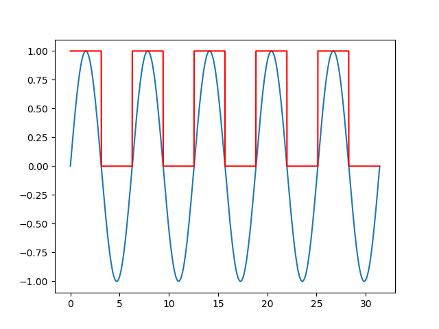
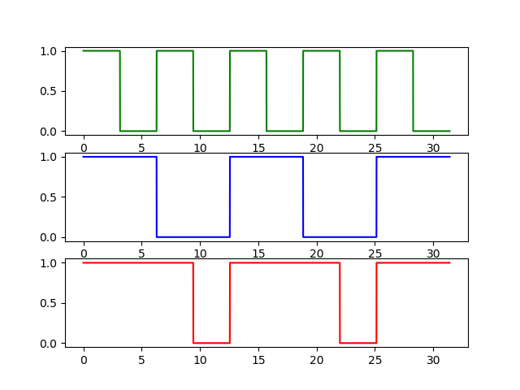
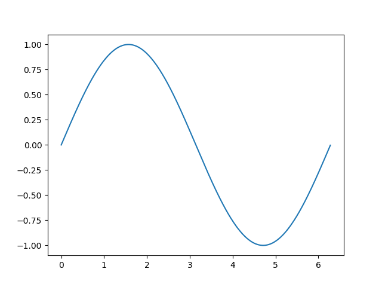

# Programing lectures for a friend

## Lesson 1: What is programing?

### Alapok röviden

Mi a programozás?
Az elektromos jeleket valahogy át kell alakítani a képernyő pixeleivel megjeleníthető formába.
Első lépésként csináljunk a generált sinus jelből egy könnyen kezelhető négyszögjelet.



_(Vegyük észre hogy a négyszögjelet már lenormáltuk 0 és 1 közé.)_

A függvény azon része ami nagyobb mint 0 ott a jel 1-et ad, ahol kisebb ott pedog 0-t.
Ezeket az értékeket innentől fogva könnyen tudjuk használni, hiszen nincsenek köztes értékek, illetve pontosan tudjuk a jel elejét és végét.
Természetesen ilyen jelek a valóságban nemléteznek.
Az fizikai lehetetlenség lenne.
Az egyszerűség kedvéért azonban ezzel számolunk a továbbiakban (a többit a villamosmérnökökre bízva).

A továbbiakban tehát maximális értékeink illetve minimális értékeink lesznek.
Innentől fogva pedig a megszokott matematika mehet a kukába.
Ha van ugyanis két maximális értékünk annak az eredménye nem lehet "még maximálisabb".
Természetesen nem a spanyol viasz feltalálásával foglalkozunk.
[George Boole](https://en.wikipedia.org/wiki/George_Boole)
már rég megalkotta a matematiaki alapját, így utána [Boolean algebrá](https://en.wikipedia.org/wiki/Boolean_algebra)nak nevezzük.
Igy az összeadás illetve kivonás műveletek is 'and' és 'or' műveletek lesznek.



Ezek után már csak a megfelelő függvényt kell megtalálni.
A függvények (mostantól bitsorozatok) generálása egymáshoz történő összeadással kivonással és negálással érhető el.

### Processzor

Ahhoz hogy egy képernyő összes pixelének színét kiszámoljuk

1360 \* 768px \* 3 color-chanel \* 256bit = 802 160 640 

értéket kell kiszámolni 30-szor egy másodperc alatt.
Termöszetesen ezt nem közzel szämoljuk.
Erre van nekünk segítségünkre a __Central Processing Unit (CPU)__.
A jelenlegi csúcstechnológia: Intel® Core™ i7-8700K Processor
- Órajel: 3.70 GHz
- Magok: 6
- Szálak: 12 (2/mag)
- Instruction Set: 64-bit

Mit jelent ez mind?
Kiderítjük.
Hz a mértékegysége a peroiodikus függvények sűrűségének.
Egy periodus az mikor a függvény vissaztér a kiindulási állapotába, és ugyan olyan a meredeksége.



A [Hz](https://en.wikipedia.org/wiki/Hertz) azt méri hogy egy másodperc alatt hányszor tér vissza egy periódus.

Ez egy processzor esetében azt jelenti hogy hány alkalommal tud új értékeket betölteni és kiszámolni egy másodperc alatt.
A Hz előtti [G](https://en.wikipedia.org/wiki/Metric_prefix) a giga előtagot jelenti.
A jelenlegi processzor tehát minden másodpercben 3 700 000 000 műveletet végez el (Flops).

A magok száma azt jelenti hogy a processzoron hány számítási egység van elhelyezve.
Ezek egyszerre tudnak egymástól függetlenül számolni.
Ezzel meg 6-szorozzuk a teljesítményt.
Szintén itt említhető meg hogy minden szál kész szálat kezel egyszerre párhuzamosan.
Így valójában nem 6-szorosára hanem 12-szeresére nől a teljesítmény.

44.4 GFlops

Az utolsó paraméter (64-bit) azt írja le hogy mennyire széles függvényekkel képes számolni a processzor.
Egy számítás esetén 2 darab 64 bites értéket emel be a memóriából, és ad ki egy 64 bites eredményt.
Ez 64-szeresére növeli a számítási kapacitást.

2841.6 GFlops = 2.8416 TFlops

Ez láthatóan messze felülszárnyalja a szükséges 802 MFlops teljesítményt amit szükségesnek számoltunk.

### Programnyelvek

A teljesítményt már bizonyítottuk hogy rendelkezésre áll.
Most már csak azt kell valahogy elérnünk hogy ez a teljesítmény megfelelően hasznosuljon.
Az előző részben megfigyelhetjük a szakszavak között az "Instruction Set" kifejezést.
Ez pont az mint aminek az ember nyers fordítás alapján gondolja.
Minden processzor rendelkezik a gyártásnál előre meghatározott utasításokkal.
Ez egy 64 bites Neumann processzor eseté ben 2^64=18[E](https://en.wikipedia.org/wiki/Exa-)különböző utasítással.
Mivel ez minden 64-bites processzorban ilyen sok, és mindegyikben gyártófüggő ezért elengedhetetlen volt hogy egy köztes megoldást ne találjanak.
[Dennis Ritchie](https://en.wikipedia.org/wiki/Dennis_Ritchie) 1973-ban megaokotta a [C](https://en.wikipedia.org/wiki/C_(programming_language)) programozási nyelvet.
Az első olyan nyelv volt ami használt valós nyelvi elemeket, így könnyen írható volt a kód.
Ami még egyszerúbbé tette az a fordító program volt.
A C kódot egy automatizált program lefordította processzor utasításokra így a programozónak nem kellett a programját minden processzor nyelvére külön megírni.

```{c}
#include <stdio.h>

int main(int argc, char* argv){
    printf("Hello World!");
    return 0;
}
```

Ez a program minden ggépen amire van C fordító le tud futni.
Ezt a remek ötletet kihasználva elkezdtek terjedni a programozási nyelvek.
Manapság az egyik legelterjedtebb a JavaScript.
Mivel egy webalkalmazáshoz ez elengedhetetlen tudás, mindamellet könnyen tanulható, így először ezt vesszük górcső alá.

### JavaScript types

### HTML basics
